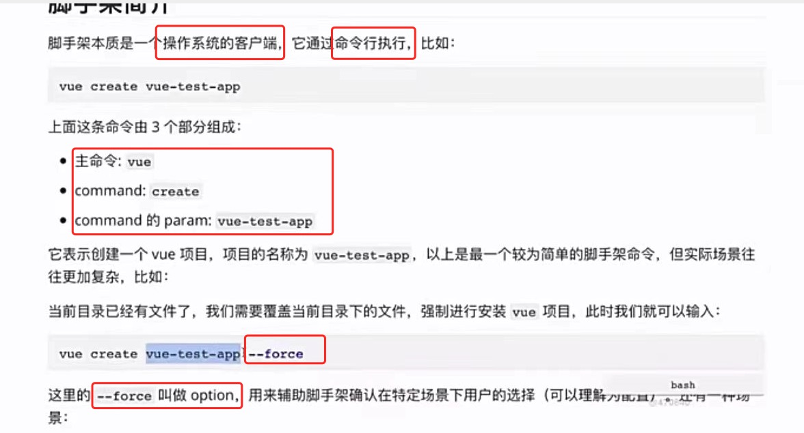
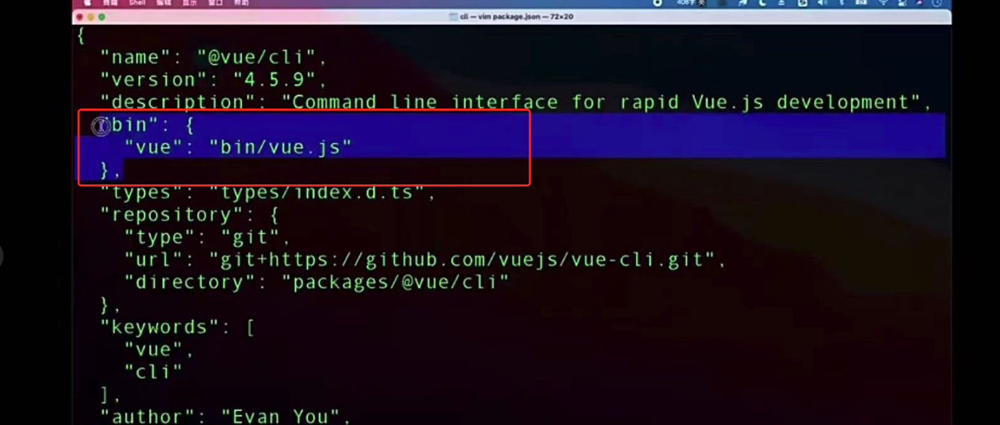
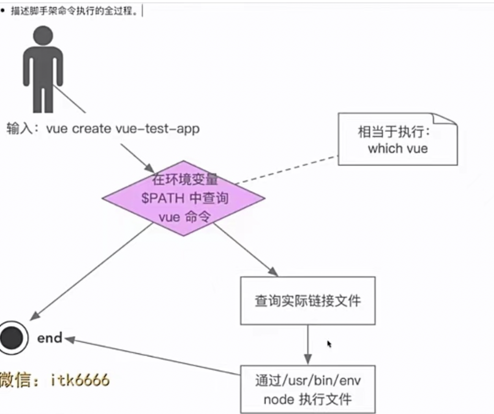

# 脚手架相关

## 1 脚手架执行流程

1 脚手架的命令行构成：




2 脚手架的命令行 内部执行流程：

S1 安装@vue/cli 并生成 node命令配置
  - 实现并发布npm包(项目名称为 @vue/cli)，其内部包含1个 bin/vue.js文件
  - 用户全局安装@vue/cli==> 会把@vue/cli安装到 node/lib/node_modules下
  - 在 node/bin目录下，配置了软链==> vue: lib/node_modules/@vue/cli/bin/vue.js文件

S2 用户在终端 执行命令行：vue create demo
  - 1 终端解析出vue命令: 
  - 2 终端在【环境变量】中找到 vue命令: 
  - 3 终端根据 vue命令, 找到 链接的实际文件vue.js: 【命令-文件】映射关系 配置在node/bin目录下
  - 4 终端利用node 执行vue.js
  - 5 vue.is 解析 command/options
  - 6 vue.js 执行 command
  - 7 执行完毕，退出执行

用图表示为 <br/>

   

---------------------------------------------------------
Q2 全局安装@vue/cli(npm install -g @vue/cli) 时发生了什么
  - 为什么全局安装 @vue/cli后 会添加的命令 vue
  - 执行vue命令时发生了什么/ 为什么vue指向一个js文件，我们却可以直接通过vue命令 执行它
 
  - 为什么说脚手架本质是操作系统的客户端/ 它和我们在PC上安装的应用/软件有什么区别
  - 如何为脚手架命令 创建别名
  - 描述脚手架命令执行的全过程

A: <br/>
S1 @vue/cli项目内部有 package.json文件（记作 A文件） + bin/vue.js文件
> package.json文件里，配置了 { ......, "bin": {"vue": "bin/vue.js" } }

具体见图 

S2 用户全局安装@vue/cli==>
  - S2.1 会把 @vue/cli安装到 node/lib/node_modules下
> 所以 bin/vue.js此时的本地路径为 node/lib/node_modules/ @vue/cli/bin/vue.js

  - S2.2 会在 node/bin目录下，根据A文件，生成了[命令-文件软链]映射
> vue: lib/node_modules/@vue/cli/bin/vue.js文件

```js
// 由S2.2可知：node根据A文件，在全局路径下注册了 vue命令
which vue
>   /User/xxxx/node/v12.xxx/bin/vue

// 大致可以用以下命令，在node/bin目录下 创建出[命令-文件软链]映射：
cd ~/.nvm/versions/node/v12.11.1/bin/
ln -s /Users/xxx/test.js  imooc-test
```

S3 在 @vue/cli/bin/vue.js文件内部，定义 `#!/usr/bin/env node`，由此在命令行中直接输入该文件名后，就可以自动执行该js文件了

```js 
// @vue/cli/bin/vue.js 部分内容
#!/usr/bin/env node

const chalk, semver = require( ' @vue/cli-shared-utils')
const requiredVersion = require(' ../package.json').engines.node
const leven = require('leven')
function checkNodeVersion (wanted, id) {
  ......
}
```

> #!/usr/bin/env node 这句话的意思，大致是 查找用户本地环境的node路径，并通过node执行该文件，其效果等价于

```js
#!/usr/bin/env node + test.js  ==>
  命令行中输入 test.js 效果等价于 usr/bin/env node test.js === node test.js
```

用图表示为 


S4 用以下方法为脚手架命令 创建别名

```js
// 大致可以用以下命令，在node/bin目录下 创建出[命令-文件软链]映射：
cd ~/.nvm/versions/node/v12.11.1/bin/
ln -s /Users/xxx/test.js  imooc-test

ln -s imooc-test bieming2
```

