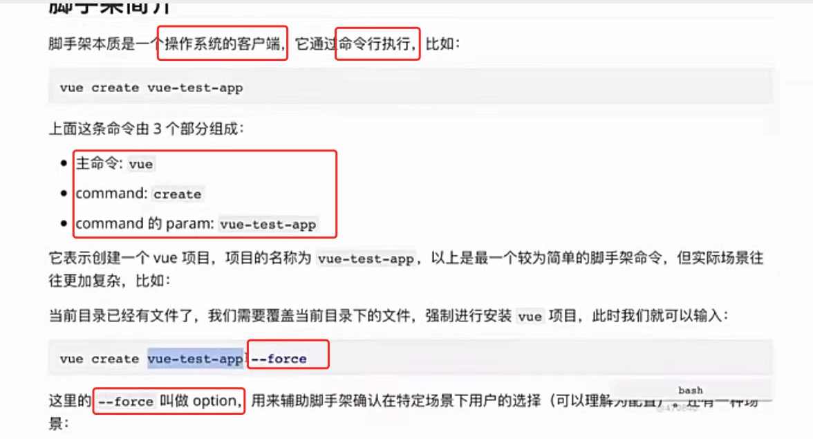
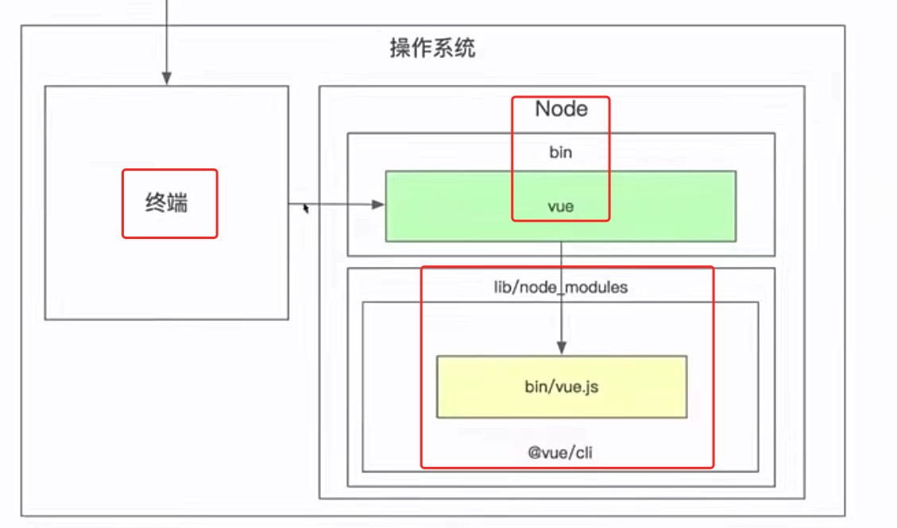

# 脚手架相关

## 1 脚手架执行流程

1 脚手架的命令行构成：

2 脚手架的命令行 内部执行流程：

S1 安装@vue/cli 并生成 node命令配置
  - 实现并发布npm包(项目名称为 @vue/cli)，其内部包含1个 bin/vue.js文件
  - 用户全局安装@vue/cli==> 会把@vue/cli安装到 node/lib/node_modules下
  - 在 node/bin目录下，配置了软链==> vue: lib/node_modules/@vue/cli/bin/vue.js文件

S2 用户在终端 执行命令行：vue create demo
  - 1 终端解析出vue命令: 
  - 2 终端在【环境变量】中找到 vue命令: 
  - 3 终端根据 vue命令, 找到 链接的实际文件vue.js: 【命令-文件】映射关系 配置在node/bin目录下
  - 4 终端利用node 执行vue.js
  - 5 vue.is 解析 command/options
  - 6 vue.js 执行 command
  - 7 执行完毕，退出执行

用图表示为  

   
  
 
