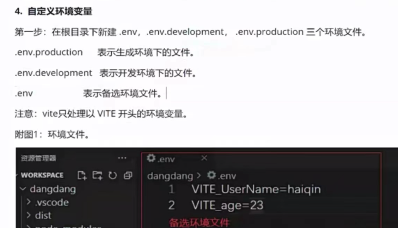

# 项目初始化相关

## 1 初始化项目

1 创建项目

S1 npm init vite

S2 选择 vue-ts

S3 npm install + npm run dev

S4 设置自动打开浏览器：在package.json中设置 "dev": "vite --open"


### 2 环境变量相关

1 查看vite环境变量

S1 npm run dev: 默认是开发环境==> 见 注释1: 查看vite环境变量

S2 npm run build + package.json中设置 { "preview": "vite preview --open --port 8888" }==> 
  - 见 注释1: 查看vite环境变量

-----------------------------------
2 自定义环境变量

S1 流程见参考图 

---------------------------------
3 添加自定义环境变量的TS提示

S1 ImportMeta.d.ts里定义了interface ImportMetaEnv，其中含有【TS索引属性】==> 
    { [key: string]: any }

S2 利用【TS接口合并】，在env.d.ts里定义:
```ts
interface ImportMetaEnv {
    VITE_myName: string
    VITE_age: number
}
```

S3 在main.ts里读取环境变量 `import.meta.env.VITE_myName`，就会出现TS提示

S4 在 package.json文件里， 通过`--mode development/production` 明确 配置环境

```js
"scripts": {
  "dev": "vite --mode development --open"
  "build": "vue-tsc && vite build --mode production --open"
  "preview": "vite preview --open"
}
```

PS: 【npm run build 里】vue-tsc的作用是：在打包之前会对代码进行TS类型检查，如果有问题就会提示错误并中止打包流程


### 3 使用 dotEnv配置 环境变量

1 安装 dotEnv: `npm install dotenv -S`

2 在vite.config.ts里使用 函数配置defineConfig，具体 vite.config.js内容

